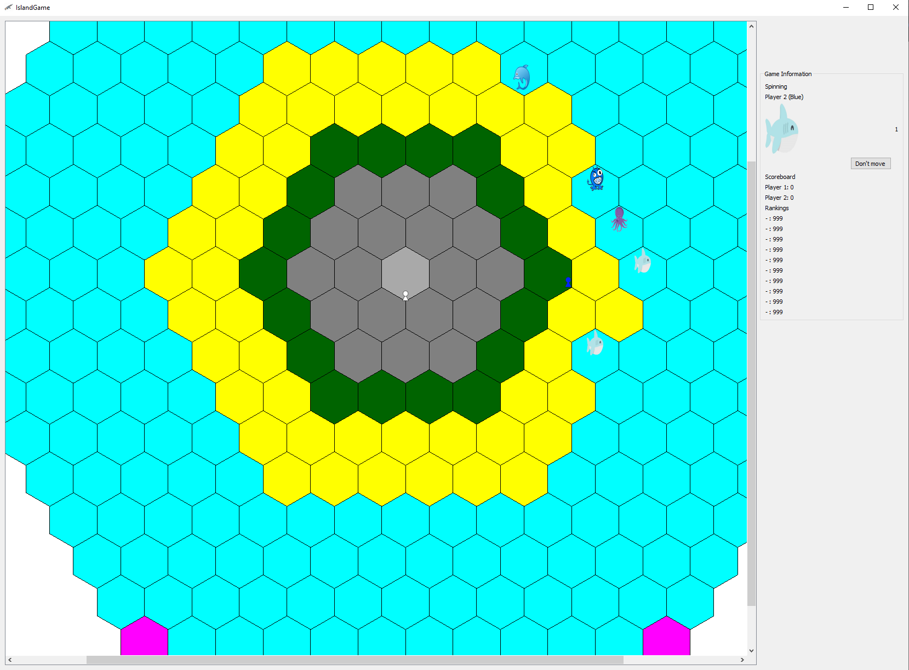

# IslandGame
Programming 3: Techniques pair project

A Programming course pair project. The task was to provide a basic rules and "front-end" (graphics, animations, moving pieces) 
to an Island game using C++ Qt. Hence everything in `\GameLogic` was provided by the course staff. Our part was to implement the
`\UI` and `\Tests`.

## Basic idea
The game consists of three phases that the player does before the player turn is switched.
- Moving phase
- Sinking phase
- Spinning phase

Moving phase begins by a player moving his/her pawn by dragging and dropping with the left mouse button. After 3 moves (1 if swimming) or the player clicking "Stay here" the game continues to the sinking phase. Here the player must choose a yellow (sand) tile that will be sank (using right mouse button). Sinking a tile reveals an Actor or Transport. Actors can kill pawns and/or Transports and Transports can be used to move more effectively in the water. In the last phase of the game player must click "Spin" in the Game Information Box. After a quick shuffle a picture of an Actor and the amount of moves can be seen (D = Dive, can move to any water tile). Player can either move the Actor or leave it be and after completing this phase players switch turns. Player wins the game by reaching a Coral tile (Pink tile).

Picture of the Game UI. The current game phase and player turn can be seen in the "Game Information" box. 

### Actors and Transports
- Shark: kills swimming pawns
- Dolphin: Helps one swimmer at a time: sharks can't kill and the pawn can move 3 times.
- Boat: Fits 3 pawns. Pawns are safe from sharks and can move 3 times.
- Kraken(purple): Destroys boats. Pawns are left swimming.
- Sea monster (blue): Kills swimmers and boats.
- Vortex: One time event. Kills all swimmers, actors and transports from the neighbouring tiles.

## Project work distribution
My part of the project ended up being:
- Project wide refactoring and documentation.
- Game initialization
- Game resetting
- Pawn, Actor, Transport moving
- "Game Information" box
- GamePhase changes

Whereas my pair did a lot of work in these parts:
- Joining the GameLogic and Graphical implementation
- Actor and Transport classes 
- Gameboard and Pawn drawing 
- Zooming and panning (gameview) 
- Actor and Transport actions
- Game finishing
- Ranking system.
